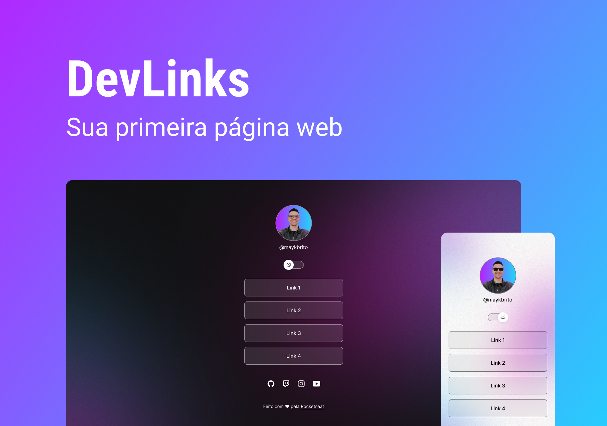

<h1 align="center"> DevLinks </h1>

Programa exclusivo e gratuito, promovido pela Rocketseat para ensino de tecnologias WEB

  <a href="#-tecnologias">Tecnologias</a>
  -
  <a href="https://guilhermesandrade.github.io/Rocketseat-Project/">Projeto</a>
  -
  <a href="https://www.figma.com/community/file/1187422022288947321">Layout</a>
  -
  <a href="#-memo-licença">Licença</a>
  

  

    
  

 

## 🚀 Tecnologias

Esse projeto foi desenvolvido com as seguintes tecnologias:

-HTML e CSS  
-JavaScript  
-Git e Github  
-Figma

 

## 💻 Projeto

O DevLinks é um agregador de links para usar como cartão de visitas online.<a href="https://guilhermesandrade.github.io/Rocketseat-Project/" target="_blank"> Ver Projeto</a>

 

## 📝 Layout

Você pode visualizar o layout do projeto [Clicando Aqui](https://www.figma.com/community/file/1187422022288947321).

É necessário ter conta no [Figma](https://www.figma.com/) para acessá-lo!

 

## 🔵 memo: Licença

Esse projeto está sob a licença MIT.

  
 

Made with ♥ by Rocketseat
 
<a href="https://discord.gg/rocketseat">Participe da nossa Comunidade 💬</a>

---
